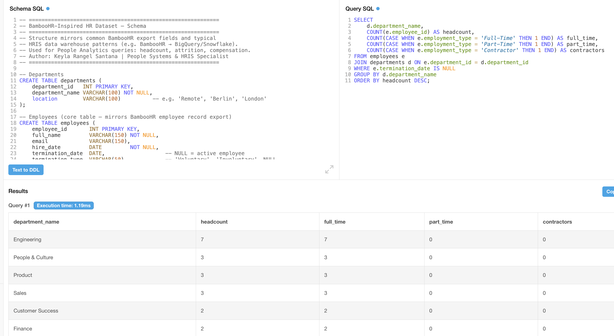
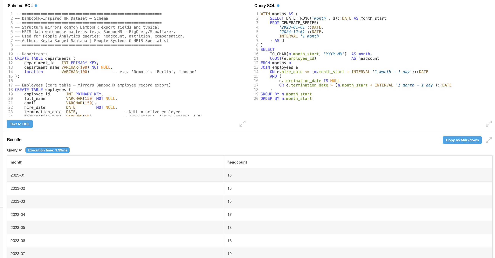
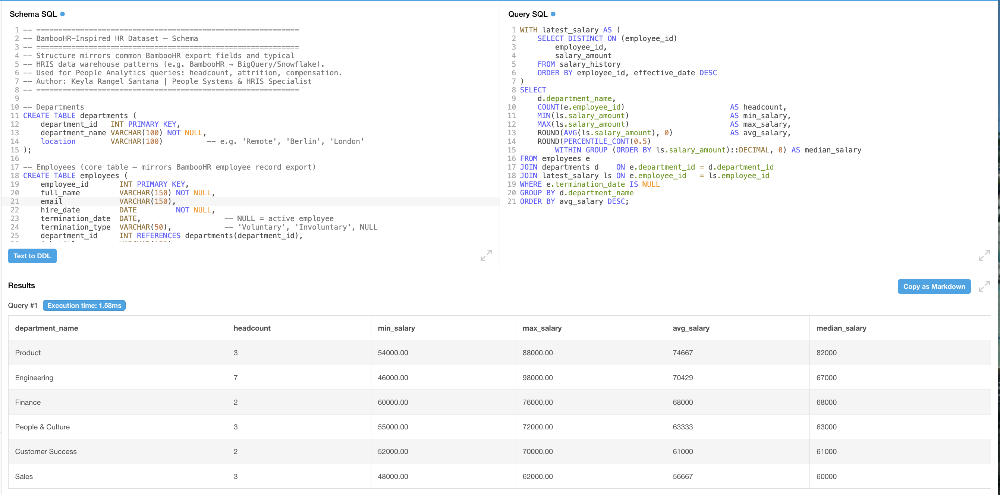
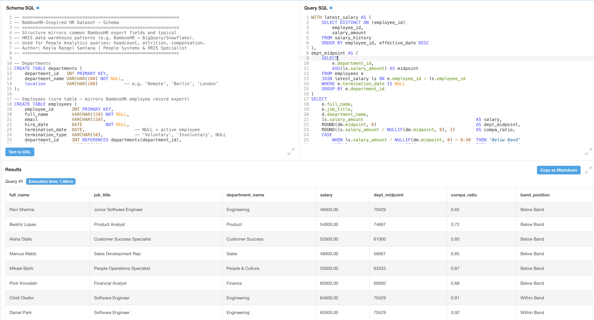

# People Analytics SQL Portfolio — BambooHR Dataset

SQL queries for People Analytics built on a dataset that mirrors **BambooHR's export structure** — the same field names and data relationships you get when exporting employee, compensation, and job history data from BambooHR into a data warehouse (BigQuery, Snowflake, PostgreSQL).

Built by **Keyla Rangel Santana** — Senior People Systems & HRIS Specialist with hands-on BambooHR experience, focused on remote-first, globally distributed teams.

---

## Repository Structure

```
├── 01_schema.sql               # Table definitions (employees, departments, salary_history, job_history)
├── 02_sample_data.sql          # Realistic fictional dataset (~28 employees, 2021–2024)
├── 03_headcount_attrition.sql  # Headcount & attrition queries
├── 04_compensation_analysis.sql # Compensation distribution & equity queries
└── README.md
```

---

## Dataset Overview

Fictional dataset for a ~28-person remote-first tech company (2021–2024).  
Designed to reflect real BambooHR export fields: hire dates, termination types, salary history with change reasons, job history with promotion tracking.

**Tables:**
- `employees` — core employee record (mirrors BambooHR Employee Export)
- `departments` — department and location data
- `salary_history` — full compensation history per employee (mirrors BambooHR Compensation Table export)
- `job_history` — role and department changes over time (mirrors BambooHR Job Information tab)

---

## Headcount & Attrition Queries

| # | Query | SQL Concepts Used |
|---|-------|-------------------|
| 1 | Active headcount by department | `GROUP BY`, `CASE WHEN`, `COUNT` |
| 2 | Monthly headcount trend (2023–2024) | CTE, `GENERATE_SERIES`, `DATE_TRUNC`, point-in-time logic |
| 3 | Annual attrition rate by year | CTE, `EXTRACT`, `NULLIF`, attrition formula |
| 4 | Attrition by department | `GROUP BY`, conditional aggregation |
| 5 | Average tenure at termination | `AVG`, `EXTRACT`, date arithmetic |
| 6 | New hires vs exits per quarter | CTE, `FULL OUTER JOIN`, `COALESCE` |

---

## Compensation Analysis Queries

| # | Query | SQL Concepts Used |
|---|-------|-------------------|
| 1 | Current salary per active employee | CTE, `DISTINCT ON`, subquery |
| 2 | Salary distribution by department | CTE, `MIN/MAX/AVG`, `PERCENTILE_CONT` |
| 3 | Salary bands by job level | CTE, `ILIKE`, `CASE WHEN`, window-ready grouping |
| 4 | Salary increase history per employee | Window function: `LAG() OVER (PARTITION BY)` |
| 5 | Employees without review in 18+ months | CTE, `AGE()`, interval filtering |
| 6 | Compa-ratio by department | CTE, derived table, ratio calculation, `CASE WHEN` banding |

## Interactive Chart

[📊 Salary Distribution by Department — Interactive Chart](https://docs.google.com/spreadsheets/d/e/2PACX-1vQdkYL_UcfnKEhzJyESyc62lexwAKL2xlbtSaU_DOHa7ByuyYl2XEeHiGu4iAqxbX2qPPLQPWV41Npp/pubhtml?gid=276830848&single=true)

*Built from SQL query results. Data: min, avg, and max salary by department across 6 teams.*
---

## SQL Concepts Demonstrated

- Common Table Expressions (CTEs)
- Window functions: `LAG()`, `PERCENTILE_CONT()`
- Point-in-time headcount reconstruction with `GENERATE_SERIES`
- `DISTINCT ON` for latest-record-per-entity pattern
- Conditional aggregation with `CASE WHEN` inside `COUNT`
- `FULL OUTER JOIN` with `COALESCE` for period comparisons
- `NULLIF` for safe division (attrition rate, compa-ratio)
- Date arithmetic with `INTERVAL`, `AGE()`, `DATE_TRUNC`, `EXTRACT`

---

## How to Run

All queries are written in **PostgreSQL** syntax.  
Compatible with: PostgreSQL 13+, Amazon Redshift (with minor adjustments), Google BigQuery (with syntax adaptations for `GENERATE_SERIES` and `DISTINCT ON`).

```sql
-- 1. Create schema
\i 01_schema.sql

-- 2. Load sample data
\i 02_sample_data.sql

-- 3. Run queries
\i 03_headcount_attrition.sql
\i 04_compensation_analysis.sql
```

---

## Context

These queries reflect the type of analysis I run in People Systems roles:
- Connecting HRIS exports (BambooHR, Personio) to reporting layers
- Building People dashboards in Google Looker Studio / Power BI
- Supporting compensation review cycles and headcount planning
- Ensuring data reliability before analysis (NULLIF, date logic, deduplication)

---

## Sample Query Outputs

### Current Active Headcount by Department


### Monthly Headcount Trend


### Salary Distribution by Department


### Compa-Ratio by Department

---

*Queries tested on PostgreSQL 15. Dataset is entirely fictional.*

