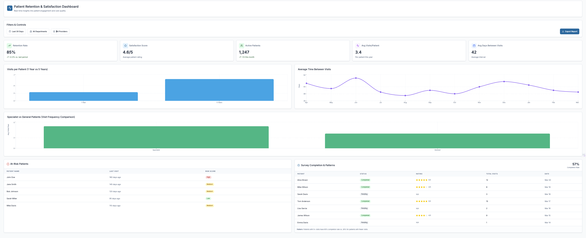

<h1 align="center">📊 Patient Retention Dashboard</h1>

A business intelligence case study on improving patient loyalty and reducing churn through data-driven insights.

---

## 🖼️ Dashboard Overview

  

---
## 🩺 **Problem**
---
Healthcare organizations often struggle to understand why patients discontinue their treatments or switch providers. Without clear visibility into retention patterns, it becomes difficult to design effective engagement and follow-up strategies.

---

## 🎯 Objective
---
Develop a business intelligence dashboard that visualizes patient retention rates, identifies key drop-off points, and highlights actionable insights to improve continuity of care.

---

## ⚙️ Approach
---
1. **Data Preparation:** Cleaned and structured patient visit data to ensure consistency and remove duplicates.  
2. **Data Modeling:** Built a relational model linking patients, visits, and treatment outcomes.  
3. **Analysis:** Calculated retention metrics such as repeat visit rate, average time between visits, and churn segments.  
4. **Visualization:** Designed an interactive dashboard to track retention trends and segment performance.

---

## 🔁 Iteration
---
After the initial version, filters and drill-downs were added to allow users to explore retention by demographics, treatment type, and time period. This improved the dashboard’s usability and strategic value.

---

## 📊 Dashboard Structure
---
- **Overview:** Key retention KPIs and overall trends.  
- **Segmentation:** Retention by age group, treatment type, and location.  
- **Trends:** Monthly and quarterly retention evolution.  
- **Insights:** Highlighted drivers of patient churn and recommendations.

---

## 💡 Business Impact
---
This dashboard enables healthcare leaders to:
- Identify patient groups with higher churn risk.  
- Optimize follow-up and communication strategies.  
- Improve overall patient satisfaction and loyalty.  

---

## 🧭 Key Takeaways
---
- Data-driven insights can significantly improve patient retention strategies.  
- Combining SQL data modeling with BI visualization creates transparency and accountability.  
- Iterative dashboard design enhances decision-making and stakeholder adoption.

---

**Tools:** SQL, Google Sheets, Looker Studio  
**Course Reference:** Google Business Intelligence Professional Certificate – Capstone Project
